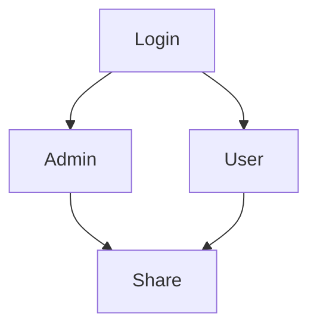

Document sharing
> The Online `Document Sharing` System is a simple file sharing platform project that can help a company share their documents. <br/>

> The system works this way. For example, a teacher will store the students' modules soft copies for week 1 in a single document and save it with the title of "Module set for week 1" and the teacher can add notes in the description box. After that, the teacher will click the "Share this Document" button on the document view page to get the shareable link. Then when the student browses the shared link in his/her browser, the document details and files will be shown, then the student can download the files by clicking the download.

## Member
|ID|Name|Details|
|---|---|---|
|1|`Dao Duy Quy`|Fullstack|
|---|---|---|
|2|`Dang Thien Hao`|Fullstack|


### Requirements
* [phpmyadmin](https://github.com/phpmyadmin/phpmyadmin)
* [AdminLTE](https://github.com/ColorlibHQ/AdminLTE)
* MariaDB
* Apache
* [Goole APIS Client](https://github.com/googleapis/google-api-php-client)
## Deployment

```shell
composer require "almasaeed2010/adminlte=~3.2"
```

```shell
composer require google/apiclient:"^2.0"
```

### Platforms
- [x] Windows 7,8,10
- [x] Linux
- [x] macOS
- [x] iOS (in progress)
- [x] android (soon)

## Features
### Both Admin and Users Side
* Login Page
  * The page where system users will submit their credentials to access the data and functionalities of the system.
* Dashboard Page
  * The page where the system users will be redirected by default after logging into the Online Document Sharing System.
* Manage Account Modal
  * The popup modal where the system users update their system credentials such as their email and password.
* Document List
  * The page where all documents are listed. The admin can see all the documents that been created in the system while the users can only see his/her created documents.
* Manage Document Page
  * The page where the system users create or update a document.
* Document View Page
  * The page where the system user can download the files of the document.
### Admin Side
* New User Page
  * The page where can system admin create a new user.
* Manage Users
  * This feature includes View, Edit, and Delete for the user list.


#### account test:
`admin@admin.com`
admin123 <br/>
`test@test.com`
test123
* You can sign with account `Google`

<details><summary>Syuq</summary>
<p>

#### We can hide anything!
[Syuq](https://github.com/Syuq)
</p>
</details>
